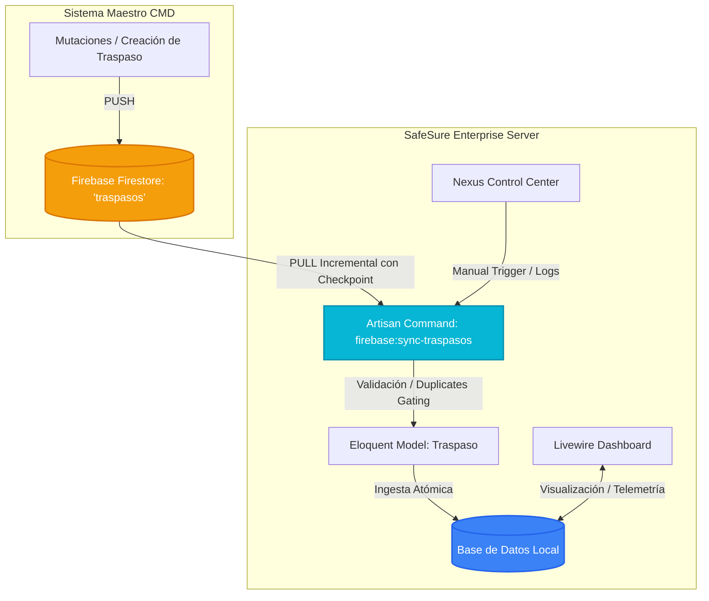

# Walkthrough: Módulo Receptor de Traspasos Firebase en SafeSure Enterprise

Este documento detalla la arquitectura, el diseño de la base de datos, el flujo de sincronización incremental y la interfaz de usuario implementada para el nuevo **Módulo de Traspasos** de SafeSure.

---

## 1. Arquitectura de Integración (CMD ➔ Firebase ➔ SafeSure)

El módulo funciona de forma **estrictamente unidireccional y de solo lectura (Receptor de Datos)** desde Firebase Firestore hacia SafeSure. Esto previene escrituras accidentales y optimiza el consumo de cuota de Firebase.



---

## 2. Componentes Clave Creados e Integrados

### A. Estructura de Datos (Base de Datos)
*   **Migración:** `database/migrations/2026_05_17_202438_create_traspasos_table.php` (Migrada con éxito).
*   **Campos Soportados:**
    *   `id` (Big Int, Autoincremental)
    *   `firebase_document_id` (Unique Index - Gating de Duplicados)
    *   `nombre_afiliado`, `cedula_afiliado`
    *   `agente` (Promotor maestro)
    *   `estado` (Remoto: EFECTIVO, etc.)
    *   `cantidad_dependientes` (Integer)
    *   `fecha_solicitud`, `fecha_efectivo`
    *   `periodo` (e.g. `2026-06`)
    *   `status_unipago` (APROBADO, RECHAZADO, PENDIENTE)
    *   `sync_status` (synced, error, pending)
    *   `firebase_updated_at` (Timestamp remoto de Firebase)
    *   `synced_at` (Timestamp de la ingesta)
    *   `source_system` (CMD)
    *   `local_updated_at` (Timestamp de última modificación local)
    *   `deleted_at` (SoftDeletes para auditoría)

### B. Modelo Eloquent y Relaciones
*   **Modelo:** [Traspaso.php](file:///c:/Users/frede.FREDERIKLOPEZ18/Desktop/Deploy/sys_safe_carnet/app/Models/Traspaso.php)
    *   Soporte completo para casts nativos de fechas (`Carbon`) para asegurar comparaciones de tiempo precisas en la sincronización incremental.

### C. Motor Artisan de Sincronización Incremental
*   **Ubicación:** [SyncFirebaseTraspasos.php](file:///c:/Users/frede.FREDERIKLOPEZ18/Desktop/Deploy/sys_safe_carnet/app/Console/Commands/SyncFirebaseTraspasos.php)
*   **Características Premium de Sincronización:**
    1.  **Checkpoints de Sincronización:** Utiliza la tabla `cloud_sync_checkpoints` para almacenar el último timestamp procesado. La siguiente iteración solo descarga documentos donde `updated_at > last_firebase_updated_at`.
    2.  **Protection SafeSync (Circuit Breaker):** Intercepta llamadas automáticamente si la cuota diaria de Firebase está al límite o si el circuito está abierto, evitando sobrecargos de lectura.
    3.  **Cancelación en Caliente:** Responde a la bandera del botón de detener de la UI (`Cache::has('firebase_sync_stop')`) deteniendo la ingesta de forma segura y consistente sin corromper la base de datos.
    4.  **Reporting en Tiempo Real:** Envía latidos (`heartbeats`) cada 5 registros al panel de telemetría de Livewire.

### D. Interfaz del Panel de Traspasos
*   **Ubicación de Componentes:**
    *   Clase de Componente: [TraspasosDashboard.php](file:///c:/Users/frede.FREDERIKLOPEZ18/Desktop/Deploy/sys_safe_carnet/app/Livewire/TraspasosDashboard.php)
    *   Vista Premium: [traspasos-dashboard.blade.php](file:///c:/Users/frede.FREDERIKLOPEZ18/Desktop/Deploy/sys_safe_carnet/resources/views/livewire/traspasos-dashboard.blade.php)
*   **Avanzado Selector de Filtros:** Permite buscar y aislar registros por Agente, Estatus Unipago, Estado Remoto, Periodo y Rango de Fechas (Solicitud / Efectiva).
*   **Modal de Detalle Translúcido:** Visualiza la trazabilidad atómica completa y comparación de tiempos remoto vs local al hacer clic en cualquier registro.

---

## 3. Integración en el Dashboard Nexus y Sidebar

Hemos integrado el nuevo módulo en dos puntos clave de la aplicación para ofrecer una experiencia fluida y unificada:

1.  **Tab en Sincronización Cloud:** Dentro del panel [Sincronización Cloud](file:///c:/Users/frede.FREDERIKLOPEZ18/Desktop/Deploy/sys_safe_carnet/resources/views/admin/sync/index.blade.php), se ha añadido una pestaña dedicada **"Sincronización de Traspasos"** que permite disparar cargas manuales y forzar reconstrucciones.
2.  **Enlace en Sidebar Global:** En la barra de navegación del workspace [sistema.blade.php](file:///c:/Users/frede.FREDERIKLOPEZ18/Desktop/Deploy/sys_safe_carnet/resources/views/layouts/sidebars/sistema.blade.php), se añadió la opción **"Traspasos Firebase"** con el icono de intercambio (`ph-swap`).

---

## 4. Comandos Útiles de Administración

Para ejecutar la sincronización incremental en segundo plano (ideal para tareas Cron):
```bash
php artisan firebase:sync-traspasos
```

Para forzar una sincronización completa ignorando checkpoints de tiempo:
```bash
php artisan firebase:sync-traspasos --full
```

---

> [!NOTE]
> La primera sincronización completa ha sido ejecutada con éxito en la máquina de desarrollo, ingestado **778 registros** procedentes del sistema maestro CMD de forma atómica y sin reportar colisiones de integridad.
